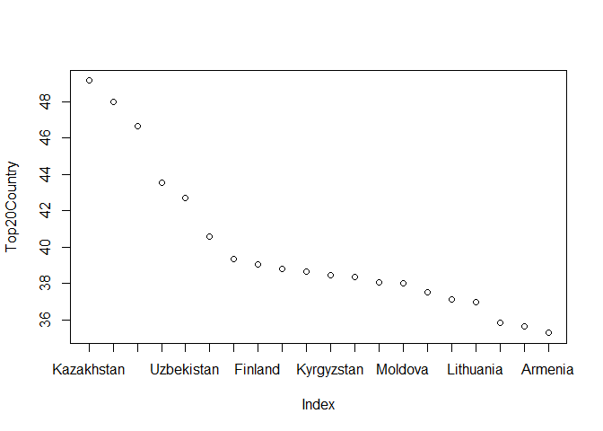
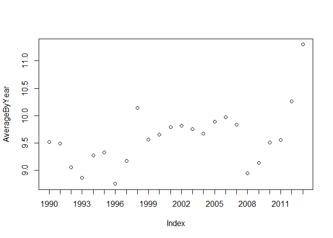
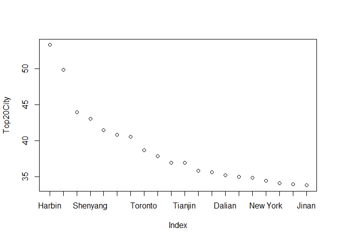

# Ques4
Elizabeth Ramsdell  
November 30, 2016  


##4i


```r
## Read file

Temp <- read.csv("Data/temp.csv", header=TRUE)


## Clean data: date, country and average temp

date1 <- as.Date(Temp$Date,format="%Y-%m-%d") 

date2 <- as.Date(Temp$Date,format="%m/%d/%Y") 

date1[is.na(date1)] <- date2[!is.na(date2)] # Combine both while keeping their ranks

Temp$Date <- date1 # Put it back in your dataframe

Temp <- Temp[!(is.na(Temp$Monthly.AverageTemp)),]

Temp$Country <- as.factor(Temp$Country)


## Subset Post-1900

PlaceholderDate <- as.Date("1900-01-01")

TempPost1900 <- Temp[Temp$Date >= PlaceholderDate,]

##(i)	Find the difference between the maximum and the minimum monthly average temperatures for each country and report/visualize top 20 countries with the maximum differences for the period since 1900

MaxByCountry <- tapply(TempPost1900$Monthly.AverageTemp, TempPost1900$Country, max)
MinByCountry <- tapply(TempPost1900$Monthly.AverageTemp, TempPost1900$Country, min)
RangeByCountry <- MaxByCountry - MinByCountry

SortedRangeByCountry <- sort(RangeByCountry, decreasing = TRUE)
Top20Country <- SortedRangeByCountry[1:20]

##Display Top 20 Countries

Top20Country
```

```
##   Kazakhstan     Mongolia       Russia       Canada   Uzbekistan 
##       49.163       48.010       46.682       43.532       42.698 
## Turkmenistan      Belarus      Finland      Estonia      Ukraine 
##       40.579       39.338       39.068       38.815       38.660 
##   Kyrgyzstan  North Korea       Latvia      Moldova    Greenland 
##       38.436       38.342       38.063       38.012       37.516 
##      Denmark    Lithuania   Tajikistan       Poland      Armenia 
##       37.138       36.970       35.829       35.616       35.273
```

```r
##Plot Top 20 Countries
xnamescountry <- names(Top20Country)
plot(Top20Country, xaxt="n")
axis(1, at=1:length(xnamescountry), labels=xnamescountry)
```

<!-- -->

##4ii

```r
##Subset for Post-1990
Date90 <- as.Date("1990-01-01")
TempPost1990 <- Temp[Temp$Date >= Date90,]

##Subset for US Data only
UStemp <- subset(TempPost1990, TempPost1990$Country == "United States")

##Create Farenheit Calculation
UStemp$Fahrenheit <- (UStemp$Monthly.AverageTemp * 1.8) + 32

##Break data by year and plot averages
UStemp$Year <- as.Date(cut(UStemp$Date, breaks = "year"))
AverageByYear <- tapply(UStemp$Monthly.AverageTemp, UStemp$Year, mean)

xnames <- substr(names(AverageByYear), start = 1, stop = 4)

plot(AverageByYear,xaxt="n")
axis(1, at=1:length(xnames), labels=xnames)
```

<!-- -->

```r
##Calculate the one year rolling difference and display maximum difference and the years
DiffByYear <- diff(AverageByYear)
SortedDiffByYear <- sort(DiffByYear, decreasing = TRUE)
SortedDiffByYear[1]
```

```
## 2013-01-01 
##   1.036028
```

```r
##The largest difference between years was from 2012-2013. This had a increase of 1.03 yearly average degrees.
```

##4iii

```r
##read city temp data
CityTemp <- read.csv("Data/CityTemp.csv", header=TRUE)

##Clean data: date, average temp, city
date1 <- as.Date(CityTemp$Date,format="%Y-%m-%d")
date2 <- as.Date(CityTemp$Date,format="%m/%d/%Y") 
date1[is.na(date1)] <- date2[!is.na(date2)]
CityTemp$Date <- date1

CityTemp <- CityTemp[!(is.na(CityTemp$Monthly.AverageTemp)),]
CityTemp$City <- as.factor(CityTemp$City)

##Subset Post-1900
CityTempPost1900 <- CityTemp[CityTemp$Date >= PlaceholderDate,]

##a.	Find the difference between the maximum and the minimum temperatures for each major city and report/visualize top 20 cities with maximum differences for the period since 1900
MaxByCity <- tapply(CityTempPost1900$Monthly.AverageTemp, CityTempPost1900$City, max)
MinByCity <- tapply(CityTempPost1900$Monthly.AverageTemp, CityTempPost1900$City, min)
RangeByCity <- MaxByCity - MinByCity
SortedRangeByCity <- sort(RangeByCity, decreasing = TRUE)
Top20City <- SortedRangeByCity[1:20]

##Display Top 20 Cities
Top20City
```

```
##           Harbin        Changchun           Moscow         Shenyang 
##           53.281           49.844           43.956           43.045 
##         Montreal             Kiev Saint Petersburg          Toronto 
##           41.422           40.784           40.510           38.683 
##          Taiyuan           Peking          Tianjin            Seoul 
##           37.834           36.953           36.953           35.783 
##          Mashhad           Dalian          Chicago         Tangshan 
##           35.610           35.223           34.962           34.833 
##         New York          Baghdad           Berlin            Jinan 
##           34.460           34.047           33.920           33.778
```

```r
##Plot
xnamescity <- names(Top20City)
plot(Top20City, xaxt="n")
axis(1, at=1:length(xnamescity), labels=xnamescity)
```

<!-- -->

##Compare plot between the top 20 Country and the top 20 City average temperatures:

The Top 20 by City has a larger range of averages than the Top 20 of Country. They are sorted so are expected to both trend down, but the City graph has a steeper drop off from the higher values. 


