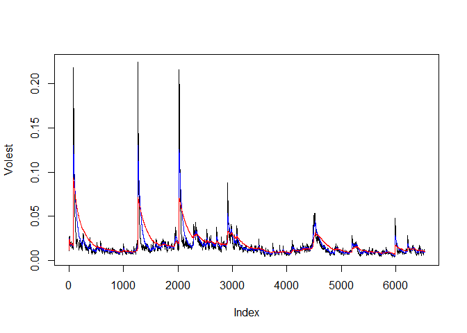

# Question2
Elizabeth Ramsdell  
November 25, 2016  


## Code


```r
library(tseries)
```

```
## Warning: package 'tseries' was built under R version 3.3.2
```

```r
Data <-get.hist.quote("adp", quote="Close")
```

```
## time series ends   2016-11-23
```

```r
DataRet <- log(lag(Data)) - log(Data)
DataVol <- sd(DataRet) * sqrt(250) * 100
vol <- function(d,logrets){
var = 0
lam = 0
varlist <- c()
for (r in logrets){
lam = lam * (1- 1/d) + 1
var = (1-1/lam)*var +(1/lam) *r^2
varlist <- c(varlist,var)
}
sqrt(varlist)
}
Volest <- vol(10,DataRet)
Volest2 <- vol(30, DataRet)
Volest3 <- vol(100,DataRet)
```

##Plots


```r
plot(Volest, type="l")
lines(Volest2, type = "l", col = "blue")
lines(Volest3, type = "l", col = "red")
```

<!-- -->


