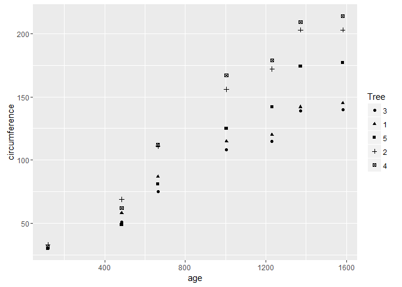
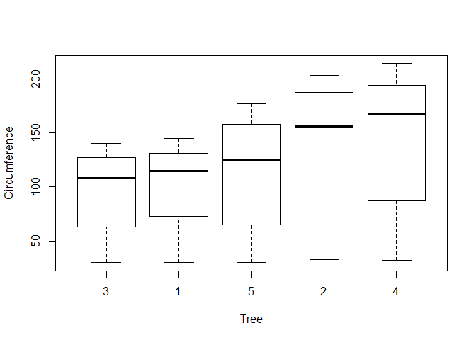

# Question3
Elizabeth Ramsdell  
November 25, 2016  


## 3A.


```r
tapply(Orange$circumference, Orange$Tree, mean)
```

```
##         3         1         5         2         4 
##  94.00000  99.57143 111.14286 135.28571 139.28571
```

```r
tapply(Orange$circumference, Orange$Tree, median)
```

```
##   3   1   5   2   4 
## 108 115 125 156 167
```

## 3B.


```r
library(ggplot2)
qplot(age, circumference, data = Orange, shape = Tree)
```

<!-- -->
## 3C.


```r
boxplot(circumference ~ Tree, data = Orange, xlab="Tree", ylab="Circumference")
```

<!-- -->

Note that the `echo = FALSE` parameter was added to the code chunk to prevent printing of the R code that generated the plot.
